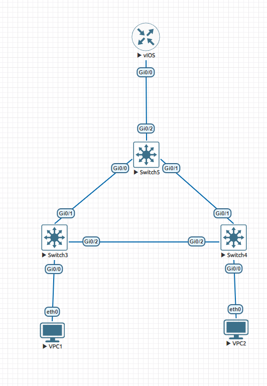
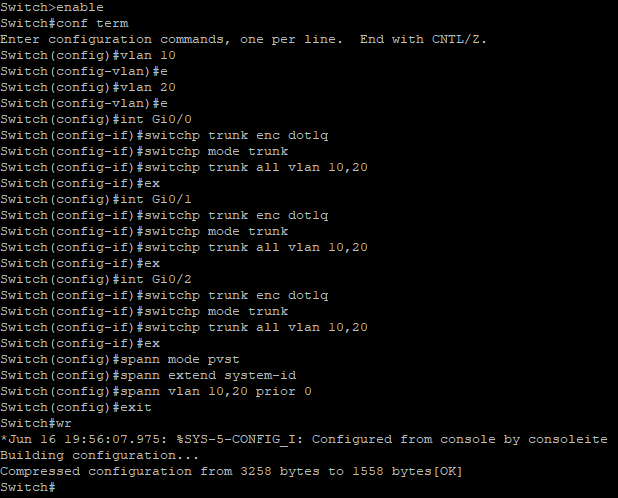

# Лаболаторная работа 1.

### Топология

### Настройка компонент
* VPC1
  
  

* VPC2

  

* Switch3

  

* Switch4

  

* Switch5

  

* vIOS

  

### Пинги между VPC

### Проверка заблокированности линка
* Spanning tree у Switch4:

  

* Линк между Switch4 и Switch3 действительно заблокировался

### Отказоустойчивость

* Выключаем интерфейс Gi0/2 у Switch3

  

* Проверяем пинги

  

  
